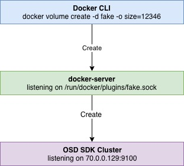

# openstorage-docker-server
### Research microservice

* Use github.com/lpabon/openstorage branch sdk-auth-4-ownership as the base
* Use dep as the tool for vendoring
* Use openstorage-sdk-clients 0.22.7 or master

### We want:
- [x] program starts listenting on a UDS for the Docker REST server. This is in openstorage StartVolumePluginAPI in
  api/server/server.go. This is started by StartPluginAPI() in cmd/osd/main.go.
- [x] Connect to unix domain socket for SDK. In cmd/osd/main.go check out sdksocket.
- [x] Test using the demo in OpenStorage.
- [x] Flag for sdk endpoint
- [ ] Support for the following commands
  - [x] create
  - [ ] delete (can get ID from name using SDK call)
  - [ ] mount
  - [ ] attach
  - [ ] detach
  - [ ] unmount

### Architecture:

